# Mermaid Flowcharts for LeadMate Project

## 1. High-Level System Architecture

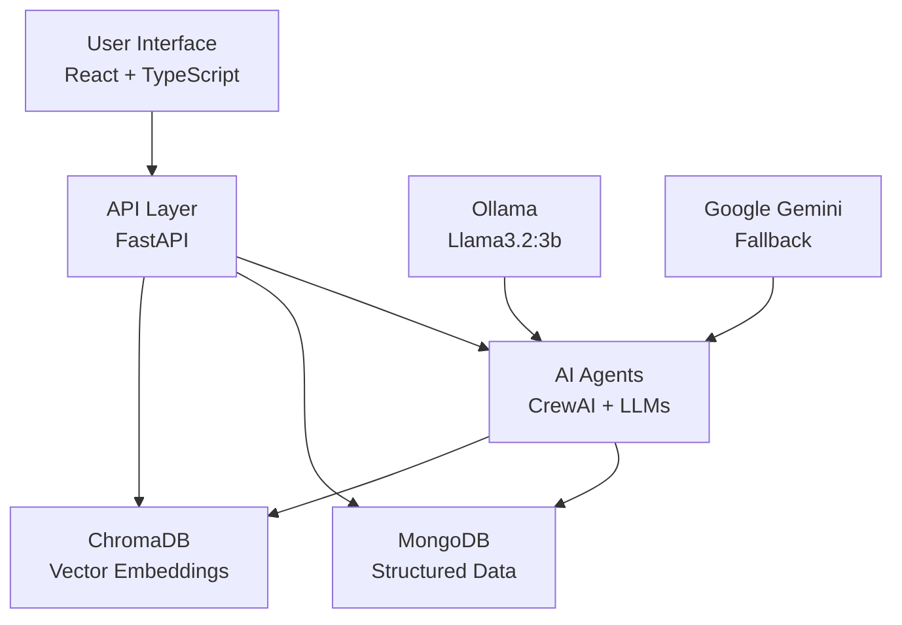

## 2. Multi-Agent System Architecture

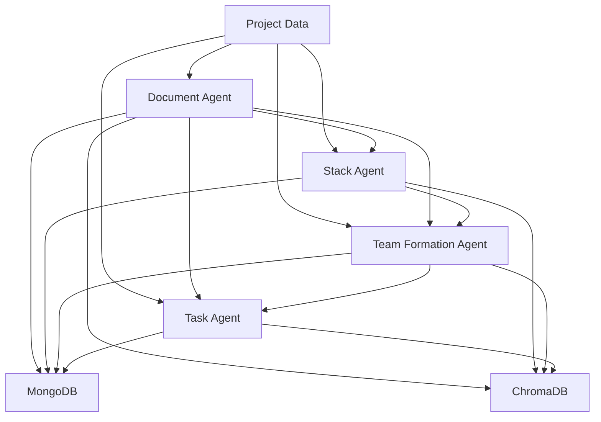

## 3. Project-Centric Data Flow

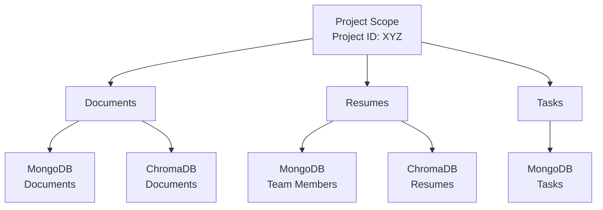

## 4. Agent Interaction Workflow

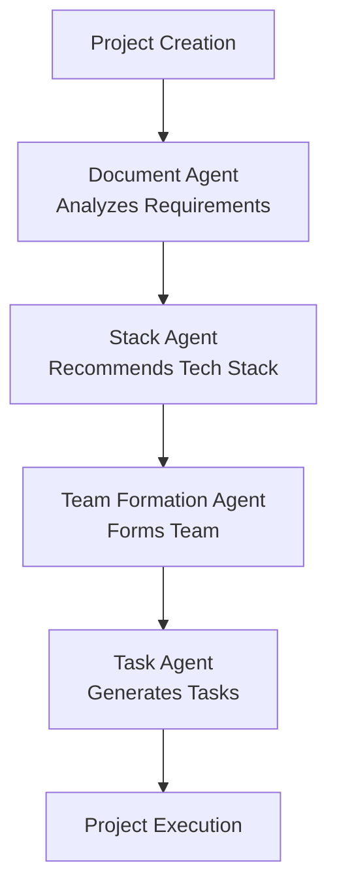

## 5. User Interaction Flow

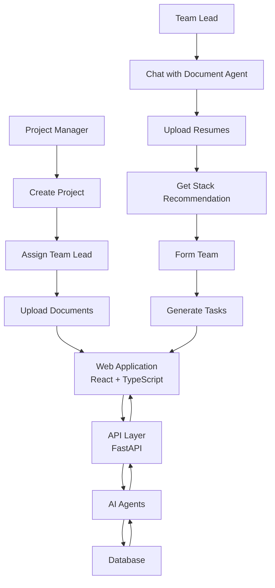

## 6. Comprehensive System Architecture - User Perspective

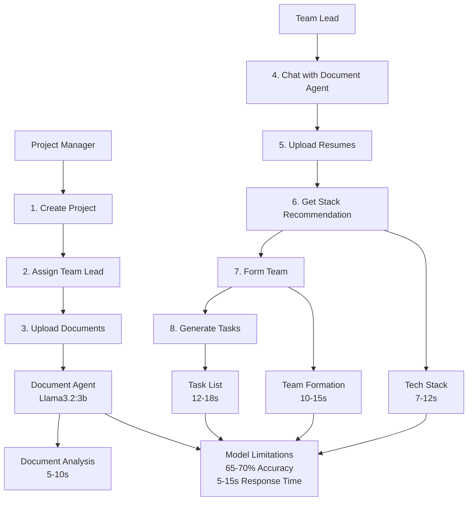

## 7. Technical Data Flow Architecture

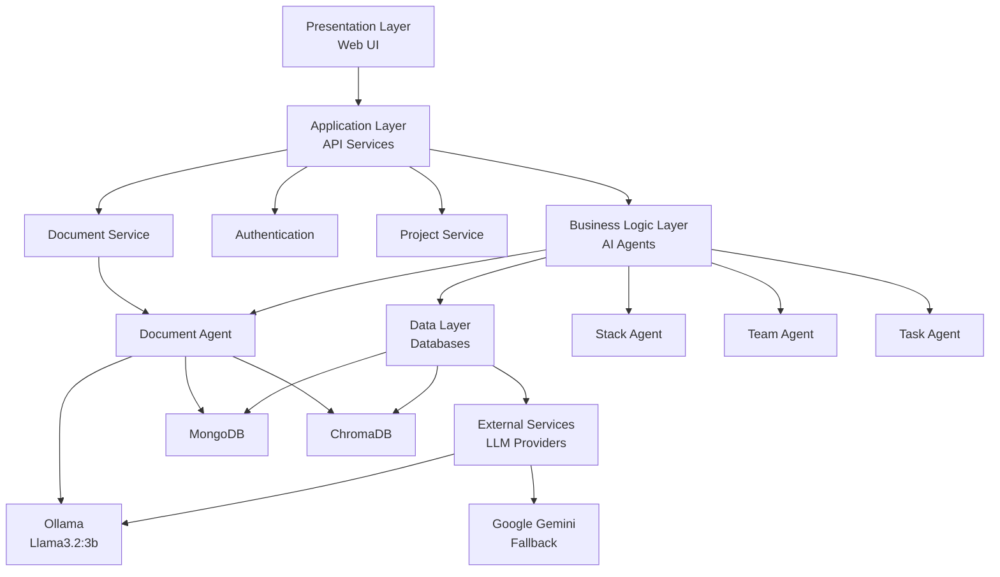

## 8. Document Agent Workflow

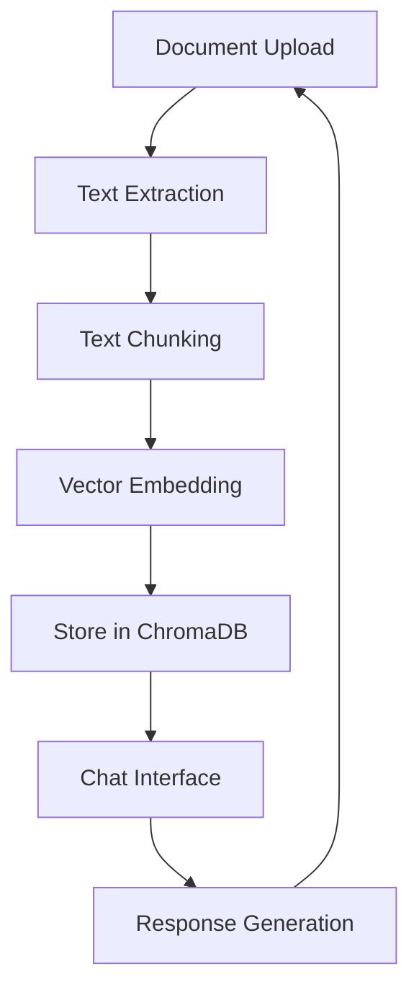

## 9. Stack Agent Workflow

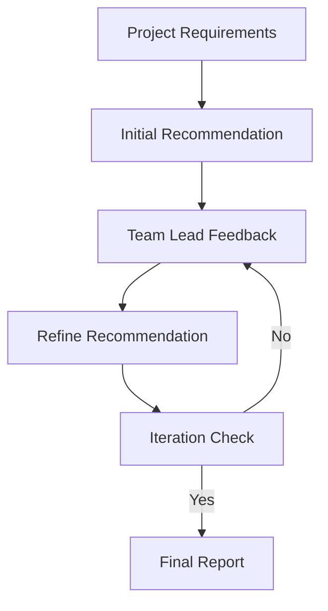

## 10. Team Formation Algorithm Workflow

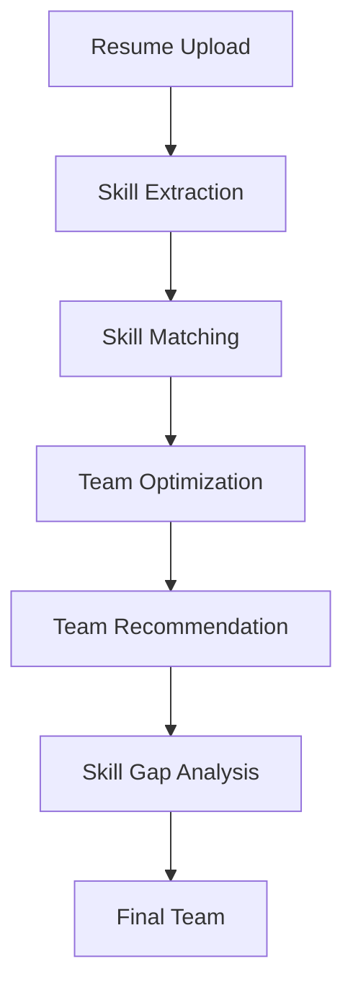

## 11. Task Generation Process

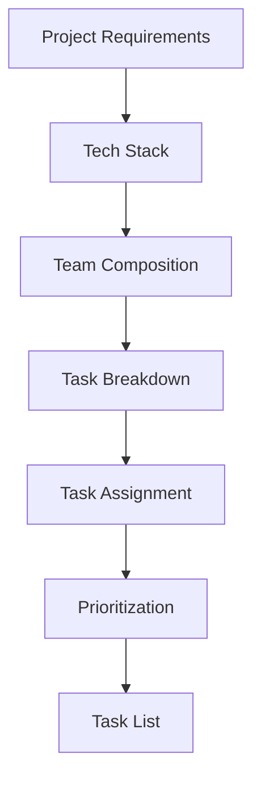

## 12. Performance Visualization

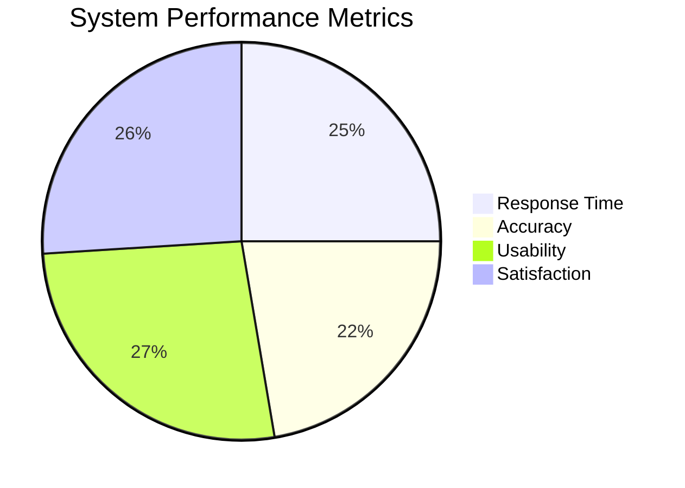

## 13. Future Architecture Evolution

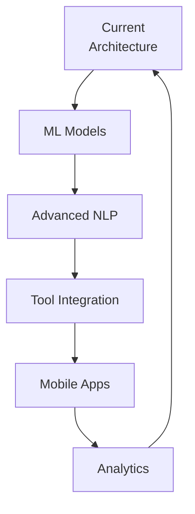

## 14. System Limitations

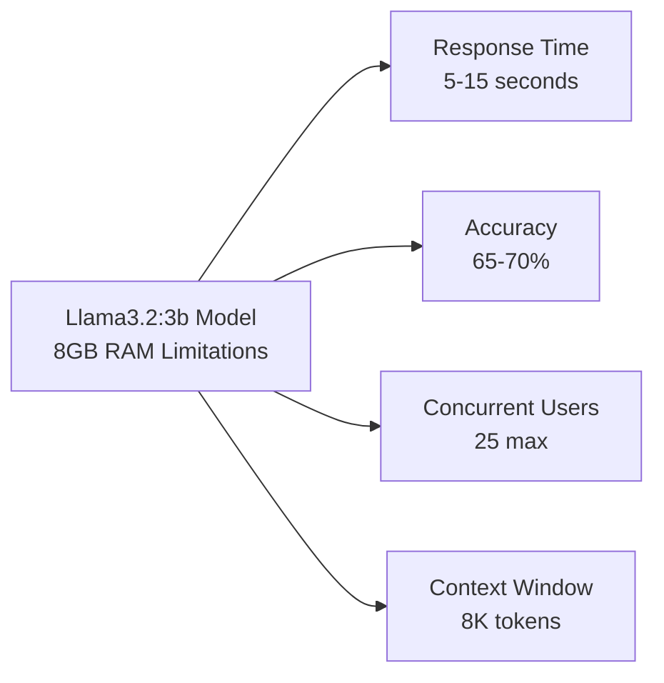

## 15. Comparison with Traditional Tools

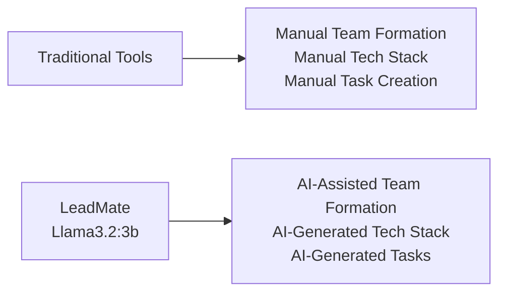