# Updated Mermaid Flowcharts for LeadMate Project with CodeClarity Agent

## 1. High-Level System Architecture with CodeClarity Agent

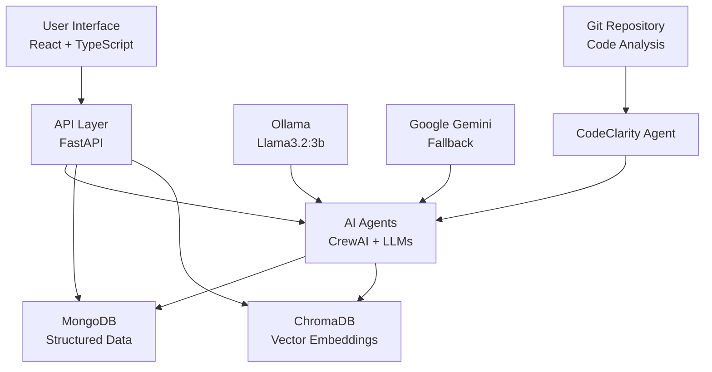

## 2. Multi-Agent System Architecture with CodeClarity Agent

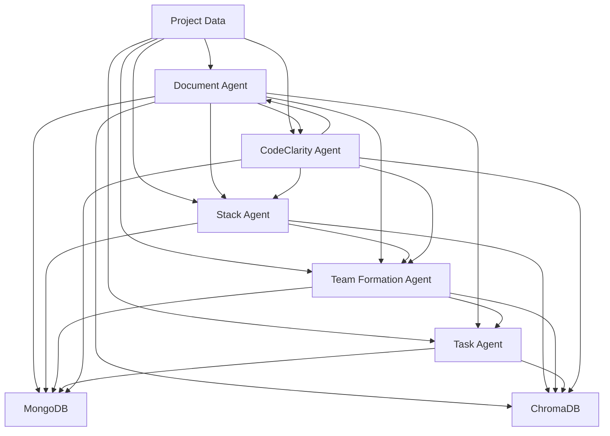

## 3. Project-Centric Data Flow with CodeClarity Integration

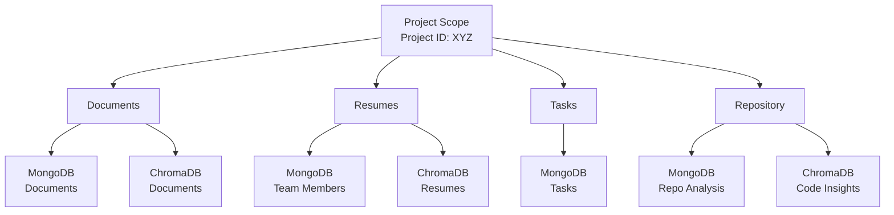

## 4. Agent Interaction Workflow with CodeClarity

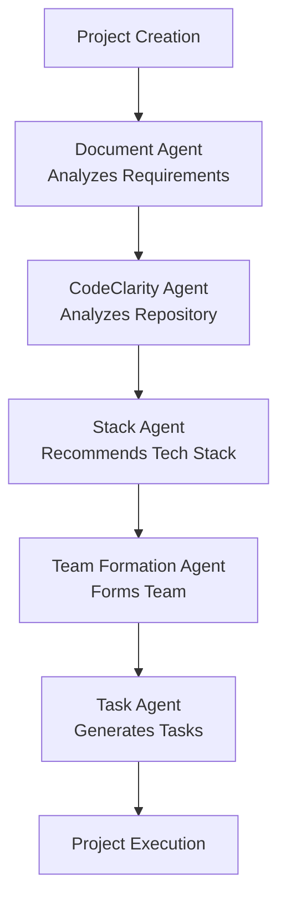

## 5. User Interaction Flow with CodeClarity

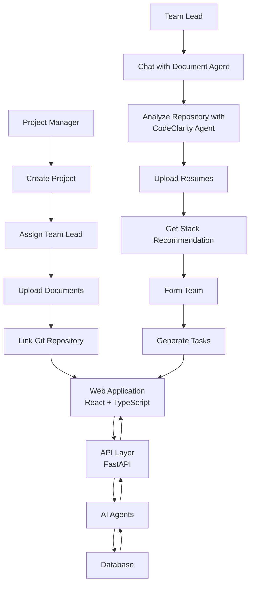

## 6. Comprehensive System Architecture - User Perspective with CodeClarity

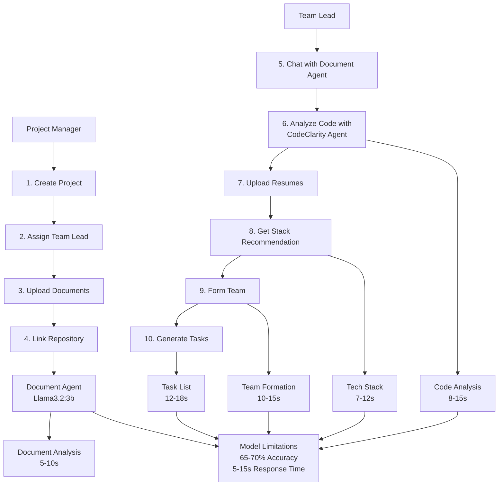

## 7. Technical Data Flow Architecture with CodeClarity

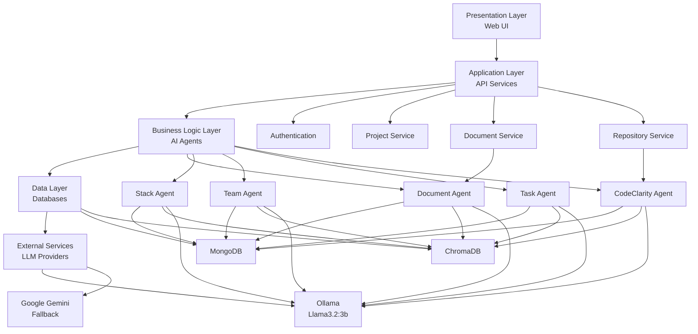

## 8. Document Agent Workflow

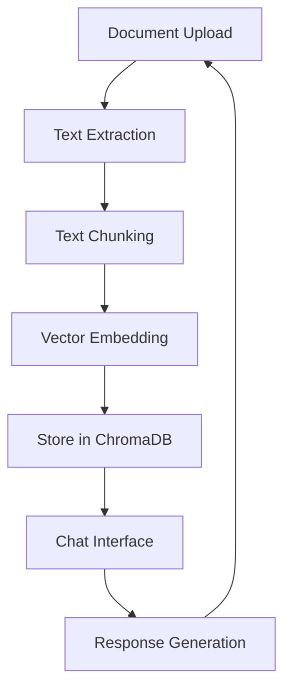

## 9. Stack Agent Workflow

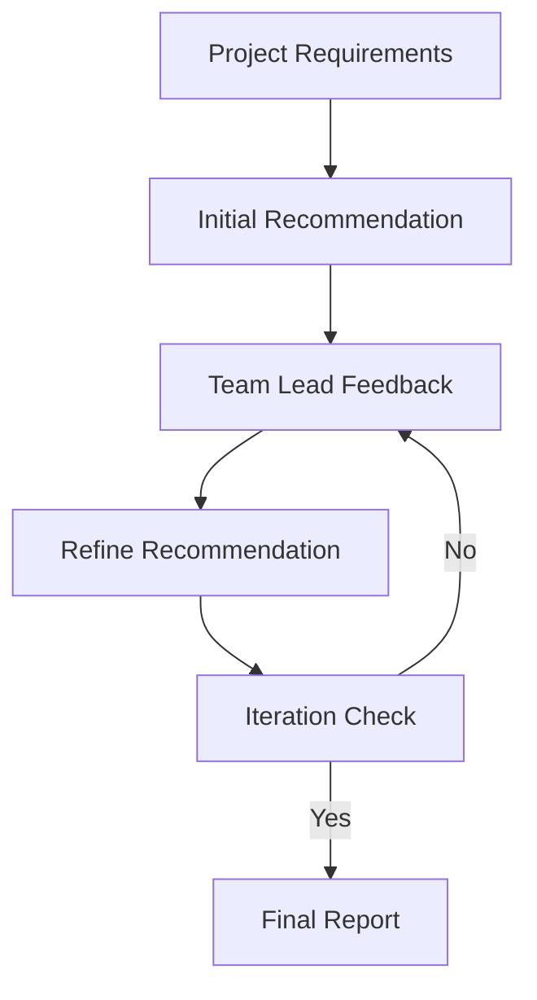

## 10. Team Formation Algorithm Workflow

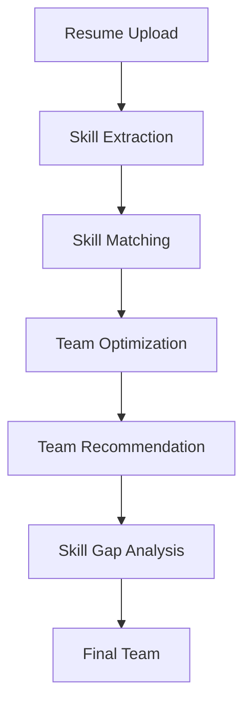

## 11. Task Generation Process

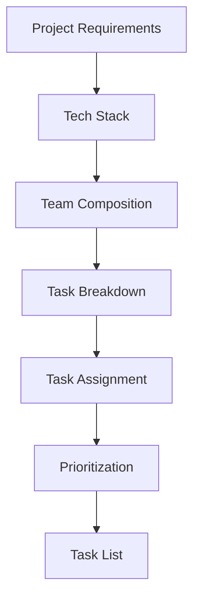

## 12. CodeClarity Agent Workflow

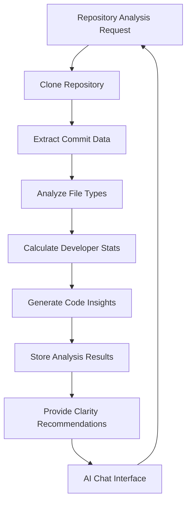

## 13. CodeClarity Agent Integration with Other Agents

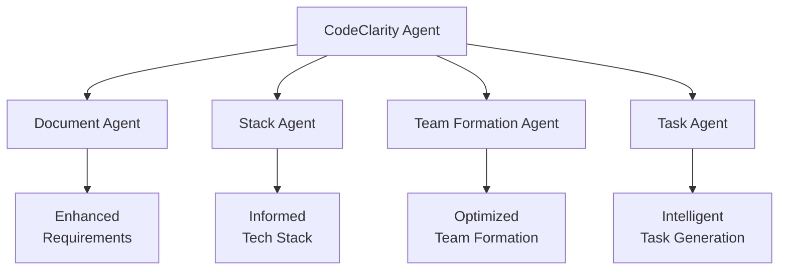

## 14. Performance Visualization

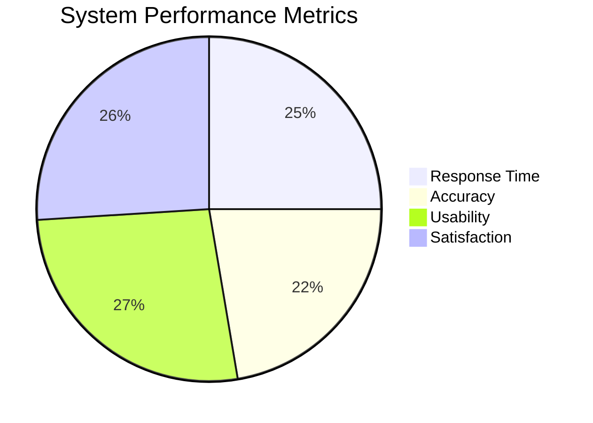

## 15. Future Architecture Evolution with CodeClarity

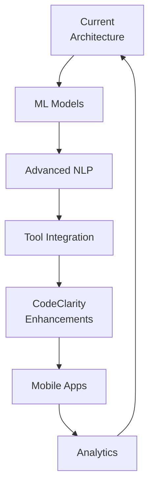

## 16. System Limitations with CodeClarity

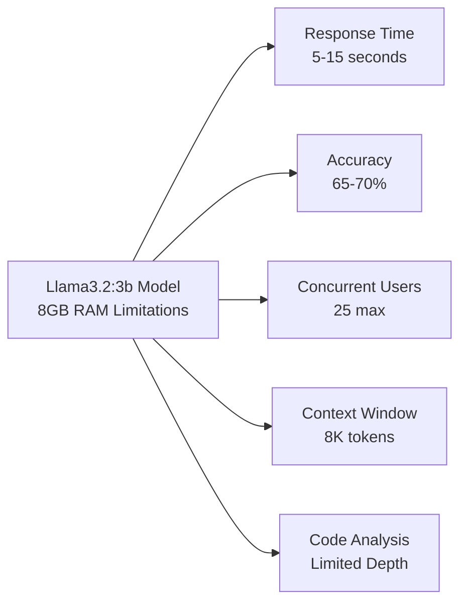

## 17. Comparison with Traditional Tools Including CodeClarity

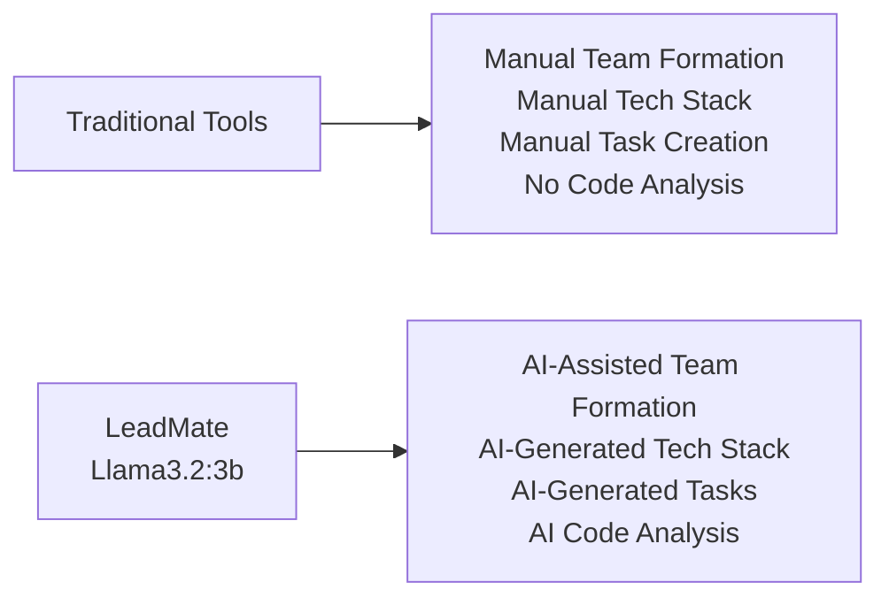